<p align="center">
  
</p>

<p align="center"><b>Fixed-for-floating swaps on Perpl funding, settled from the exchange's own accumulator.<br>No oracle. No keeper. One tap from a passkey wallet.</b></p>

<p align="center">
  <a href="https://premia-swap.vercel.app"></a>
  <a href="https://repo.sourcify.dev/143/0x4695e7747555857929CA99FC86A9F44cef832749"></a>
  <a href="https://github.com/Makabeez/premia-app"></a>
  
  
</p>
<p align="center">
  
  
  
  
  
</p>

> Built for **Metropolis** (Monad), Onchain Finance & Trading. Every claim below links to a
> mainnet transaction or to a command you can run without a wallet.

## Why

A perp trader pays, or earns, funding they cannot predict. On Perpl, ZEC funding averaged
**+16.65% APR** over our 100-day backtest (mid-September). Over the **last 7 days it has run
at −32% APR**; the sign flipped. That swing is the product: PREMIA lets the trader swap the
unknown floating funding for a fixed rate agreed today, and hands the uncertainty to someone who
wants it.

What makes it possible on Monad specifically: Perpl keeps funding as a cumulative sum per market,
**on-chain, readable at any past block**:

```solidity
getFundingSumAtBlock(uint256 marketId, uint256 blockNumber) returns (int256 sum, uint256 atBlock)
```

So a swap's floating leg is not an estimate of what funding did; it is two reads of the number
Perpl itself charged the position. **The hedge has zero basis by construction**, and settlement
needs no oracle, keeper or reporter. It is a view call anyone can make, any time after expiry,
with the same answer.

## Proof on mainnet

| What | Evidence |
|---|---|
| Contract deployed and verified | [`0x4695e774…2749`](https://repo.sourcify.dev/143/0x4695e7747555857929CA99FC86A9F44cef832749) · [deploy tx](https://app.blocksec.com/phalcon/explorer/tx/monad/0x5c2da79f4bfd1af8cff762345e0382638b0c9e8747bc5c07aa2470a29374aec5) |
| Series 0: full lifecycle, settled **5 days late** with an identical result, pot drained to exactly 0 | [`evidence/series-0.md`](evidence/series-0.md) · [settle](https://app.blocksec.com/phalcon/explorer/tx/monad/0x86d82d8615146f20e76af4ae84a7fbf28245654ac62232b8efb98699b803711c) · [claim](https://app.blocksec.com/phalcon/explorer/tx/monad/0xddaacf8fb90c0a0f2e8a57e18f1f10cd6b8c0b4d589641d7b980a4163db798fd) |
| Series 1: first hedge signed by a passkey wallet from a phone | [`evidence/series-1.md`](evidence/series-1.md) · [take](https://app.blocksec.com/phalcon/explorer/tx/monad/0x244572a6be0603672b3fc1b8b674566c20dc667842cb9e481cd8bd9af0315ceb) |
| **One tap: long 0.01 ZEC on Perpl + lock its funding**, 4 txs in 4 consecutive blocks | [`evidence/one-tap-hedge.md`](evidence/one-tap-hedge.md) · [perp](https://app.blocksec.com/phalcon/explorer/tx/monad/0x543165d15ac738939f1dcaacab6a00f3e39b5725dee1eb947a339408244efe81) · [hedge](https://app.blocksec.com/phalcon/explorer/tx/monad/0xf741cefc9bb776669dec14e6f19e429b29a3e694ca0f71ba6014e8f4713a5d34) |
| Unit scale measured against a live Perpl position, not assumed | [`evidence/unit-scale-50.json`](evidence/unit-scale-50.json) (1 lot = 0.01 ZEC, ratio 100.0007) |

### Real vs simulated

| | Status |
|---|---|
| Contract, settlement, claims | **Real**: Monad mainnet, real AUSD |
| Perp leg (Perpl) | **Real**: live order book, account 5365, 0.01 ZEC long |
| Passkey wallet | **Real**: Galaxy S25 Ultra, Google Password Manager, re-derived after uninstall |
| Counterparties | **Builder-owned so far**: every maker quote came from the deployer wallet; the passkey wallet is a separate address but also the builder's. No outside taker yet |
| Maker pricing | **Manual**: quotes posted by hand near trailing funding; the maker bot was not built |

## Architecture

```
 phone (Expo, Android)                           Monad mainnet
 ┌─────────────────────────────┐   execOrder    ┌────────────────────────────┐
 │ passkey ──PRF──▶ secp256k1  │───────────────▶│ Perpl Exchange             │
 │ (mera; key never stored)    │                │  Fsum[market] per block ───┼──┐
 │                             │   take/claim   ├────────────────────────────┤  │ getFundingSumAtBlock
 │ "Lock my ZEC funding"       │───────────────▶│ PremiaSwap                 │◀─┘ (historical view)
 │  = long perp + pay fixed    │                │  256-tick bitmap quote book│
 └─────────────────────────────┘                │  AUSD escrow, clamped ±cap │
                                                │  settle(): permissionless  │
                                                └────────────────────────────┘
```

## Flow

1. Anyone lists a **series**: market, start/end block, tick grid, cap per lot.
2. Makers post **quotes** on a 256-tick on-chain book (one bitmap word per side, FIFO per tick).
   The full downside is escrowed in AUSD at post time.
3. Takers **cross the book** with a limit tick. Price priority comes from the bitmap, time
   priority from the FIFO; there is no off-chain matching engine.
4. After `endBlock`, **anyone calls `settle`**: two reads of Perpl's accumulator give the floating
   leg; the interval count comes from Perpl's own recorded funding blocks.
5. Each side **claims**: `cap ± (floating − K × intervals)`, clamped. The pot always drains to zero.

## The contract

```solidity
function settle(uint256 id) external {
    Series storage s = _series[id];
    if (s.settled) revert AlreadySettled();
    if (block.number <= s.endBlock) revert NotExpired();
    (int256 perLot, uint256 intervals) = perpl.accrual(s.marketId, s.startBlock, s.endBlock);
    s.netPerLot = int128(perLot); s.intervals = uint32(intervals); s.settled = true;
    emit Settled(id, s.netPerLot, s.intervals);
}
```

Fully collateralised and clamped, so there are no liquidations, no ADL and no bad debt. On ZEC
the escrow is **0.04 AUSD per lot, about 0.3% of notional**, because `cap` is sized from the
measured funding distribution (p99, clamp bound), not guessed. See [BENCHMARKS.md](BENCHMARKS.md).

## Verify it yourself (no wallet, no API key)

```bash
forge test                                            # 22 tests: 15 unit + 7 forked from live mainnet
python3 script/backtest.py                            # 100 days of funding, all 8 Perpl markets, ~40 s
cast call 0x34B6552d57a35a1D042CcAe1951BD1C370112a6F \
  "getFundingSumAtBlock(uint256,uint256)(int256,uint256)" 50 106861063 \
  --rpc-url https://rpc.monad.xyz                     # recompute series 0's settlement yourself
```

The fork tests fork at HEAD and pass historical blocks as arguments, so they need no archive node.

## Tech stack

| Layer | |
|---|---|
| Contracts | Solidity 0.8.30, Foundry (Monad build), Sourcify verification |
| Settlement data | Perpl `getFundingSumAtBlock` (historical, on-chain) |
| Collateral | AUSD (Agora) |
| Mobile | Expo SDK 57, React Native, viem · see [premia-app](https://github.com/Makabeez/premia-app) |
| Accounts | mera (Category Labs): passkey PRF → EOA, no smart account, no custody backend |
| Hosting | Vercel (passkey domain + evidence page) |

## Honest limits

- **Counterparties are the builder's own wallets so far.** The flow works between distinct
  addresses; outside liquidity is the open problem.
- The two legs of the one-tap hedge are **separate transactions**. If the swap fails after the
  perp fills, the perp stays open, unhedged. EIP-7702 batching (mera signs authorizations) would
  make it atomic.
- **ZEC only.** HYPE and MON were picked by the backtest, but neither has a measured unit scale
  or a series yet, and the perp leg is wired for ZEC.
- Payoffs are **clamped at ±cap**: an extreme funding run beyond the cap is truncated, by design.

## Attribution

[Perpl](https://perpl.xyz) (funding accumulator, order book) · [mera](https://github.com/category-labs/mera)
by Category Labs (passkey accounts) · AUSD by Agora · [Monad](https://monad.xyz).

## License

MIT
